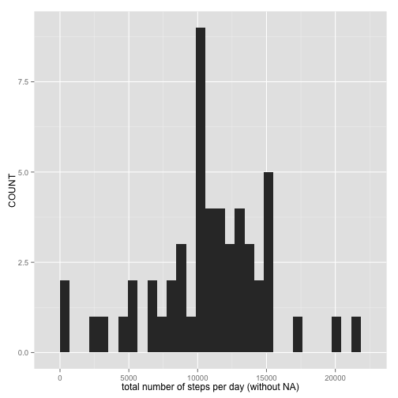
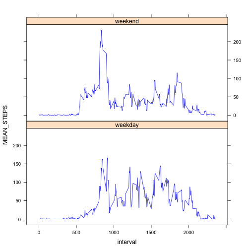
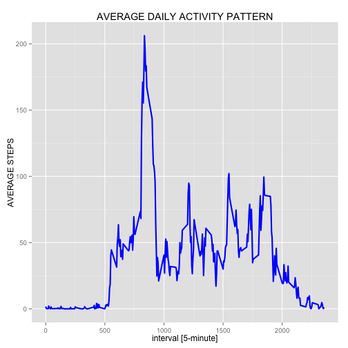
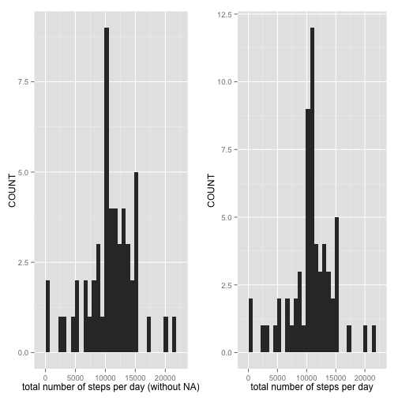

It is now possible to collect a large amount of data about personal movement using activity monitoring devices such as a Fitbit, Nike Fuelband, or Jawbone Up. These type of devices are part of the “quantified self” movement – a group of enthusiasts who take measurements about themselves regularly to improve their health, to find patterns in their behavior, or because they are tech geeks. But these data remain under-utilized both because the raw data are hard to obtain and there is a lack of statistical methods and software for processing and interpreting the data.

This assignment makes use of data from a personal activity monitoring device. This device collects data at 5 minute intervals through out the day. The data consists of two months of data from an anonymous individual collected during the months of October and November, 2012 and include the number of steps taken in 5 minute intervals each day.

##  DATA
The data for this assignment can be downloaded from the course web site:
Dataset: [Activity monitoring data [52K]](https://d396qusza40orc.cloudfront.net/repdata%2Fdata%2Factivity.zip). The variables included in this dataset are:

- steps: Number of steps taking in a 5-minute interval (missing values are coded as NA)

- date: The date on which the measurement was taken in YYYY-MM-DD format

- interval: Identifier for the 5-minute interval in which measurement was taken

The dataset is stored in a comma-separated-value (CSV) file and there are a total of 17,568 observations in this dataset.

## What is mean total number of steps taken per day?
1. For this part of the assignment, you can ignore the missing values in the dataset.
2. Calculate the total number of steps taken per day
3. Make a histogram of the total number of steps taken each day

Calculate and report the mean and median of the total number of steps taken per day


```r
# TITLE ------------------------------------------------------------------------------------------
# Boesch Daniel
# 2015-12-13
# REQUIRED PACKAGES ------------------------------------------------------------------------------
  library(data.table)
  library(plyr)
  library(ggplot2)
  library(gridExtra)
  library(lubridate)
  library(lattice)

# LOADING THR RAW_DATA ----------------------------------------------------------------------------
  if( !file.exists("RAW_DATA") ){
    cat("< create the folder: RAW_DATA >")
    dir.create("RAW_DATA")
  }
  
  if( !file.exists("RAW_DATA/activity.csv") ){
    cat("< the data are loading >")
    fileURL <- "https://d396qusza40orc.cloudfront.net/repdata%2Fdata%2Factivity.zip"
    zipDATA <- "RAW_DATA/DATASET"
    download.file(fileURL, destfile = zipDATA, method = "curl")
    unzip(zipDATA, exdir = "RAW_DATA")
    rm(fileURL, zipDATA)
  }
  
  activity = fread("./RAW_DATA/activity.csv")
  
# DATA PREPROCESSING  ------------------------------------------------------------------------------
  # delete all uncomplete rows
  activity <- activity[ complete.cases(activity), ]
  
  activity_summarie = ddply(
                            activity, .(date), 
                            summarize, 
                            SUM_STEPS    = sum(steps)
                            )
# HISTORAM: TOTAL NUMBERS OF STEPS TAKEN PER DAY ------------------------------------------------
  p1 <- ggplot( activity_summarie, aes( x = SUM_STEPS ) )
  p1 <- p1 +  geom_histogram() + 
       xlab( "total number of steps per day (without NA)" ) +
       ylab( "COUNT" )
  
  print(p1)
```

```
## stat_bin: binwidth defaulted to range/30. Use 'binwidth = x' to adjust this.
```

 

```r
  png(filename = "./figures/plot1.png", width = 480, height = 480)
  p1
```

```
## stat_bin: binwidth defaulted to range/30. Use 'binwidth = x' to adjust this.
```

```r
  dev.off()
```

```
## Error in dev.off(): QuartzBitmap_Output - unable to open file './figures/plot1.png'
```

```r
  # mean:
  print(mean(activity_summarie$SUM_STEPS))
```

 

```
## [1] 10766.19
```

```r
  # median:
  print(median(activity_summarie$SUM_STEPS))
```

```
## [1] 10765
```

```r
  # sum:
  print(sum(activity_summarie$SUM_STEPS))
```

```
## [1] 570608
```

## What is the average daily activity pattern?

1. Make a time series plot (i.e. type = "l") of the 5-minute interval (x-axis) and the average number of steps taken, averaged across all days (y-axis)

2. Which 5-minute interval, on average across all the days in the dataset, contains the maximum number of steps?


```r
# AVERAGE DAILY ACTIVITY PATTERN ------------------------------------------------------------------
  activity_summarie2 = ddply(
    activity, 
    .(interval), 
    summarize, 
    MEAN_STEPS    = mean(steps)
  )
  
  p2 = ggplot(activity_summarie2, aes(interval, MEAN_STEPS)) + 
      geom_line(colour = "blue", size = 1) +
      xlab( "interval [5-minute]" ) +
      ylab( "AVERAGE STEPS" ) +
      ggtitle( "AVERAGE DAILY ACTIVITY PATTERN" )
  
  png(filename = "./figures/plot2.png", width = 480, height = 480)
  p2
  dev.off()
```

```
## Error in dev.off(): QuartzBitmap_Output - unable to open file './figures/plot2.png'
```

```r
  activity_summarie2[which.max(activity_summarie2$MEAN_STEPS), ]
```

 

```
##     interval MEAN_STEPS
## 104      835   206.1698
```

```r
  p2
```

 

## Imputing missing values
Note that there are a number of days/intervals where there are missing values (coded as NA). The presence of missing days may introduce bias into some calculations or summaries of the data.

1. Calculate and report the total number of missing values in the dataset (i.e. the total number of rows with NAs)

2. Devise a strategy for filling in all of the missing values in the dataset. The strategy does not need to be sophisticated. For example, you could use the mean/median for that day, or the mean for that 5-minute interval, etc.

3. Create a new dataset that is equal to the original dataset but with the missing data filled in.

4. Make a histogram of the total number of steps taken each day and Calculate and report the mean and median total number of steps taken per day. Do these values differ from the estimates from the first part of the assignment? What is the impact of imputing missing data on the estimates of the total daily number of steps?


```r
 # IMPUTING MISSING VALUES -------------------------------------------------------------------------
  
  # NUMBER OF MISSING VALUES
  activity2 = fread("./RAW_DATA/activity.csv")
  
  length(complete.cases(activity) == FALSE) # 2304 NA
```

```
## [1] 15264
```

```r
  activity2[ !complete.cases(activity2), ]
```

```
##       steps       date interval
##    1:    NA 2012-10-01        0
##    2:    NA 2012-10-01        5
##    3:    NA 2012-10-01       10
##    4:    NA 2012-10-01       15
##    5:    NA 2012-10-01       20
##   ---                          
## 2300:    NA 2012-11-30     2335
## 2301:    NA 2012-11-30     2340
## 2302:    NA 2012-11-30     2345
## 2303:    NA 2012-11-30     2350
## 2304:    NA 2012-11-30     2355
```

```r
  # DATA IMPUTATION: Replace NA through MEAN in this timeperiod
  imputValue = function(x){
    m = mean(x[ , 1], na.rm = TRUE)
    if( is.na(m) ){ m = 0 }
    x[is.na(x[ , 1]), 1] <- m
    return(x)
  }
  
  # NEW DATA THROUGH DATA IMPUTATION
  new_activity = ddply(activity2, .(interval), imputValue)
  
  activity_summarie3 = ddply(
    new_activity, .(date), 
    summarize, 
    SUM_STEPS    = sum(steps)
  )
  
  p3 <- ggplot( activity_summarie3, aes( x = SUM_STEPS ) )
  p3 <- p3 +  geom_histogram() + 
    xlab( "total number of steps per day" ) +
    ylab( "COUNT" ) 
  
  png(filename = "./figures/plot3.png", width = 480, height = 480)
  p3
```

```
## stat_bin: binwidth defaulted to range/30. Use 'binwidth = x' to adjust this.
```

```r
  dev.off()
```

```
## Error in dev.off(): QuartzBitmap_Output - unable to open file './figures/plot3.png'
```

```r
  # mean:
  print(mean(activity_summarie3$SUM_STEPS))
```

 

```
## [1] 10766.19
```

```r
  # median:
  print(median(activity_summarie3$SUM_STEPS))
```

```
## [1] 10766.19
```

```r
  # sum:
  print(sum(activity_summarie3$SUM_STEPS))
```

```
## [1] 656737.5
```

```r
  # DIFFERENCE
  p31 <-grid.arrange(p1, p3, ncol=2) 
```

```
## stat_bin: binwidth defaulted to range/30. Use 'binwidth = x' to adjust this.
## stat_bin: binwidth defaulted to range/30. Use 'binwidth = x' to adjust this.
```

 

```r
  print(p31)
```

```
## TableGrob (1 x 2) "arrange": 2 grobs
##   z     cells    name           grob
## 1 1 (1-1,1-1) arrange gtable[layout]
## 2 2 (1-1,2-2) arrange gtable[layout]
```

```r
  png(filename = "./figures/plot31.png", width = 480, height = 480)
  p31
```

```
## TableGrob (1 x 2) "arrange": 2 grobs
##   z     cells    name           grob
## 1 1 (1-1,1-1) arrange gtable[layout]
## 2 2 (1-1,2-2) arrange gtable[layout]
```

```r
  dev.off()
```

```
## RStudioGD 
##         2
```

The impact is that with data imputation we have more observations in the center.

## Are there differences in activity patterns between weekdays and weekends?

1. For this part the weekdays() function may be of some help here. Use the dataset with the filled-in missing values for this part.

2. Create a new factor variable in the dataset with two levels – “weekday” and “weekend” indicating whether a given date is a weekday or weekend day.

3. Make a panel plot containing a time series plot (i.e. type = "l") of the 5-minute interval (x-axis) and the average number of steps taken, averaged across all weekday days or weekend days (y-axis). See the README file in the GitHub repository to see an example of what this plot should look like using simulated data.


```r
# DIFFERENCES IN ACTIVITY PATTERNS BETWEEN WEEKDAYS AND WEEKENDS  ----
  new_activity$date <- ymd(new_activity$date)
  new_activity$weekday <- wday(new_activity$date, label = TRUE)
  new_activity$week <- ifelse((new_activity$weekday == "Sat" | new_activity$weekday == "Sun"), "weekday", "weekend")
  new_activity$week <- as.factor(new_activity$week)
  
  activity_summarie4 = ddply(
    new_activity, .(interval, week), 
    summarize, 
    MEAN_STEPS    = mean(steps)
  )
  
  p4 =xyplot(  MEAN_STEPS ~ interval | week,
            data = activity_summarie4,
            type = "l",
            col.line = "blue",
            layout = c(1,2)
          )
  
  print(p4)
```

 

```r
  png(filename = "./figures/plot4.png", width = 480, height = 480)
  p4
  dev.off()
```

```
## Error in dev.off(): QuartzBitmap_Output - unable to open file './figures/plot4.png'
```

 

As you can see in the picture the activity patterns between weekdays and weekends is different.


